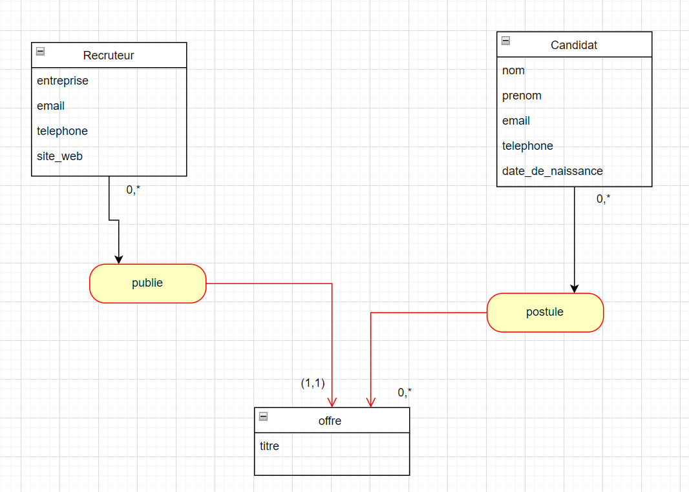

# Projet Backend Recrutement - API Django/Python

Ce projet est une application Django qui permet de gérer les informations des candidats et des recruteurs dans un système de recrutement. Il fournit une API REST qui permet d'interagir avec la base de données des candidats et des recruteurs.

Les livrables du projet incluent :
- La mise en place d'une application Django/Python.
- L'intégration d'un ou plusieurs modèles liés à des tables dans une base de données **PostgreSQL**.
- La création de **Endpoints API** pour interagir avec les informations des candidats et des recruteurs.
- Une **documentation OpenAPI (Swagger)** générée pour les développeurs frontend.

## Objectifs
- Créer une API qui permettra aux candidats de renseigner et consulter leurs informations personnelles.
- Fournir aux recruteurs un moyen de consulter les informations des candidats.
- Fournir une documentation interactive via Swagger pour faciliter l'intégration côté frontend.

## Technologies utilisées
- **Backend** : Django/Python
- **Base de données** : PostgreSQL
- **API** : REST
- **Documentation API** : Swagger (via `drf-yasg`)
- **IDE** : Visual Studio Code (VSCode)
- **Contrôle de version** : GitHub

## Fonctionnalités
1. **Modèles** : 
   - **Candidat** : Un modèle pour stocker les informations des candidats (nom, prénom, email etc.).
   - **Recruteur** : Un modèle pour stocker les informations des recruteurs.
2. **Endpoints API** :
   - **/api/candidates/** : Permet de récupérer et d'ajouter des informations sur les candidats.
   - **/api/recruiters/** : Permet de récupérer et d'ajouter des informations sur les recruteurs.
3. **Swagger** : Une interface Swagger interactive pour consulter et tester les endpoints de l'API.

## Installation

### Prérequis
- **Python** 
- **PostgreSQL** 
- **Django**  
- **Django framework**

### Créer et activer l'environnement virtuel
Créez un environnement virtuel pour gérer les dépendances du projet. Depuis la racine du projet, exécutez :

```bash
python -m venv myenv
source myenv/bin/activate 
``` 

### Installer Django
utilisez la commande suivante :
```bash
pip install django
```

### Installer PostgreSQL pour Django
utilisez la commande suivante :
```bash
pip install psycopg2
```

### Installer drf-yasg pour la documentation
utilisez la commande suivante :
```bash
pip install drf-yasg
```

### Créez une base de données
```bash
CREATE DATABASE recrutement_db
```

### Configuration de la base de données
- Créez une base de données PostgreSQL pour votre projet.
- Configurez la connexion à la base de données dans le fichier **settings.py** de Django.
```bash
DATABASES = {
    'default': {
        'ENGINE': 'django.db.backends.postgresql',
        'NAME': 'recrutement_db',
        'USER': 'postgres',
        'PASSWORD': 'kenza',
        'HOST': 'localhost',
        'PORT': '5432',
    }
}
```

### Créer les migrations et appliquer la base de données

Une fois la base de données configurée, créez les tables en exécutant les commandes suivantes :

```bash
python manage.py makemigrations
python manage.py migrate
```

### Lancer le serveur Django
```bash
python manage.py runserver
```

Le serveur sera disponible sur [http://127.0.0.1:8000](http://127.0.0.1:8000). Vous pouvez accéder à la documentation Swagger en accédant à [http://127.0.0.1:8000/swagger/](http://127.0.0.1:8000/swagger/).

## Structure du projet
```bash
recrutement/
├── README.md
├── api/
│   ├── __init__.py
│   ├── admin.py
│   ├── apps.py
│   ├── migrations/
│   ├── models.py
│   ├── serializers.py
│   ├── tests.py
│   ├── urls.py
│   ├── views.py
│   └── swagger.py
├── manage.py
├── myenv/
├── recrutement/
│   ├── __init__.py
│   ├── asgi.py
│   ├── settings.py
│   ├── urls.py
│   ├── wsgi.py
│   └── swagger.py
└── swagger.py
```

## Explication du code
### Modèles 
Le fichier models.py définit les modèles de données pour les Candidats et les Recruteurs.

- Modèle Candidat
Le modèle Candidat contient les informations suivantes sur un candidat :

**nom** : Le nom du candidat (de type CharField avec une longueur maximale de 100 caractères).

**prenom** : Le prénom du candidat (de type CharField avec une longueur maximale de 100 caractères).


**email** : L'email du candidat (de type EmailField).

**telephone** : Le numéro de téléphone du candidat (de type CharField avec une longueur maximale de 15 caractères).

**date_naissance** : La date de naissance du candidat (de type DateField).

- Modèle recruteur
Le modèle Recruteur contient les informations suivantes sur un recruteur :

**entreprise** : Le nom de l'entreprise du recruteur (de type CharField avec une longueur maximale de 100 caractères).

**email** : L'email du recruteur (de type EmailField).

**telephone** : Le numéro de téléphone du recruteur (de type CharField avec une longueur maximale de 15 caractères).

**site_web** : Le site web de l'entreprise (de type URLField)

### Vues
Le fichier **views.py** définit les vues pour les endpoints de l'API. Chaque vue correspond à un modèle et permet de gérer les différentes requêtes HTTP.

- Vue candidat 
La vue **CandidatViewSet** expose les opérations create, retrieve, update, et destroy pour les candidats.

- Vue recruteur
De manière similaire, la vue **RecruteurViewSet** permet de gérer les opérations CRUD pour les recruteurs.

### Serializers
Le fichier **serializers.py** définit comment les modèles de données sont convertis en format JSON (et inversement). Chaque modèle a son propre sérializer.

### Swagger
Le fichier **swagger.py** utilise drf_yasg pour générer une documentation interactive de l'API avec Swagger. Cette documentation permet aux développeurs de tester facilement l'API directement depuis l'interface.

### URLs
Le fichier **urls.py** définit les routes pour l'API. Chaque vue est enregistrée dans un routeur qui expose les endpoints pour les candidats et les recruteurs.

## Diagramme UML
Diagramme des classes recruteur, candidat et offre:




## Auteurs
- Kenza HALIL


